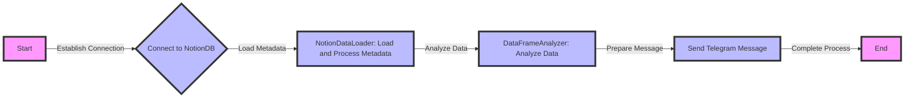

# expense_notify

Extracts expense data stored in notion, interprets it using LLM Agent and triggers a periodic notification

## Workflow



## Installation

<!-- ```bash
$ pip install expense_notify
``` -->

## Usage

placebolder


## TODO
- [ ] Work on tests and refactoring
- [ ] Set up CICD
- [ ] Documentation

## Contributing

Interested in contributing? Check out the contributing guidelines. Please note that this project is released with a Code of Conduct. By contributing to this project, you agree to abide by its terms.

## License

`expense_notify` was created by hy. It is licensed under the terms of the MIT license.

## Credits

`expense_notify` was created with [`cookiecutter`](https://cookiecutter.readthedocs.io/en/latest/) and the `py-pkgs-cookiecutter` [template](https://github.com/py-pkgs/py-pkgs-cookiecutter).
